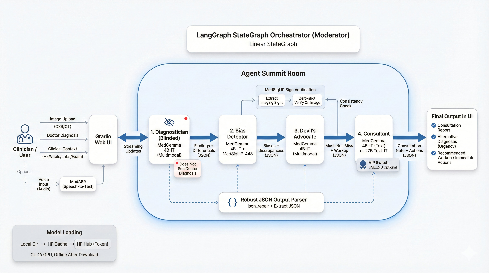

<div align="center">

# Diagnostic Devil's Advocate

**AI-Powered Cognitive Debiasing for Medical Image Interpretation**

[](https://huggingface.co/spaces/yipengsun/diagnostic-devils-advocate)
[](https://huggingface.co/google/medgemma-1.5-4b-it)
[](https://huggingface.co/google/medsiglip-448)
[](https://langchain-ai.github.io/langgraph/)
[](https://gradio.app)
[](LICENSE)

</div>

---

## Why This Exists

> Diagnostic errors affect an estimated **12 million** adults annually in the U.S., with cognitive biases implicated in up to **74%** of cases. ([Singh et al., 2014](https://pubmed.ncbi.nlm.nih.gov/24742777/))

Doctors are not wrong because they lack knowledge -- they are wrong because the human brain takes shortcuts. A physician who sees "young patient + chest pain after trauma" anchors on **rib contusion** and stops looking. The pneumothorax goes unseen. The patient deteriorates.

**Diagnostic Devil's Advocate** acts as an adversarial second opinion. It does not replace the physician -- it challenges them: *"Have you considered what happens if you're wrong?"*

---

## Pipeline

Four agents, each with a distinct adversarial role, orchestrated by [LangGraph](https://langchain-ai.github.io/langgraph/) as a linear `StateGraph`:

<div align="center">

</div>

### Key Design Choices

- **Blinded first agent** -- the Diagnostician never sees the doctor's diagnosis, preventing the AI from anchoring on the same conclusion
- **Dual-source analysis** -- every agent considers both the medical image and clinical context (vitals, labs, risk factors), because many dangerous conditions have subtle imaging but obvious clinical red flags
- **MedSigLIP verification** -- zero-shot image classification grounds the bias analysis in visual evidence, not just language reasoning
- **Collegial tone** -- the Consultant writes as a consulting colleague (*"Have you considered..."*), not a critic

---

## Model Stack

| Model | Params | Role | VRAM |
|:------|:------:|:-----|:----:|
| [MedGemma 1.5 4B-IT](https://huggingface.co/google/medgemma-1.5-4b-it) | 4B | Multimodal image + text analysis | ~4 GB (4-bit) |
| [MedGemma 27B Text-IT](https://huggingface.co/google/medgemma-27b-text-it) | 27B | Consultant deep reasoning (optional) | ~54 GB |
| [MedSigLIP-448](https://huggingface.co/google/medsiglip-448) | 0.9B | Zero-shot sign verification | ~3 GB |
| [MedASR](https://huggingface.co/google/medasr) | 105M | Medical speech-to-text | ~0.5 GB |

The full pipeline requires **~8 GB VRAM** and runs on any 12 GB+ CUDA GPU. All models load locally via [Transformers](https://huggingface.co/docs/transformers) with [4-bit quantization](https://huggingface.co/docs/bitsandbytes) -- **zero API costs, fully offline-capable**.

---

## Getting Started

```bash
# Clone
git clone https://github.com/sypsyp97/diagnostic-devils-advocate
cd diagnostic-devils-advocate

# Install
pip install -r requirements.txt

# Login to Hugging Face (gated models)
huggingface-cli login

# Run
python app.py                                    # 4B quantized (default)
USE_27B=true QUANTIZE_4B=false python app.py     # with 27B Consultant
ENABLE_MEDASR=false python app.py                # without voice input
```

The app launches at `http://localhost:7860`.

<details>
<summary><b>Environment Variables</b></summary>

| Variable | Default | Description |
|:---------|:--------|:------------|
| `USE_27B` | `false` | Enable 27B model for the Consultant agent |
| `QUANTIZE_4B` | `true` | 4-bit quantize the 4B model |
| `ENABLE_MEDASR` | `true` | Enable voice input via MedASR |
| `HF_TOKEN` | -- | Hugging Face token (or use `huggingface-cli login`) |
| `ENABLE_PROMPT_REPETITION` | `true` | [Prompt repetition](https://arxiv.org/abs/2512.14982) for improved output quality |
| `MODEL_LOCAL_DIR` | -- | Local directory for pre-downloaded models |
| `DEVICE` | `cuda` | Compute device |

</details>

<details>
<summary><b>Project Structure</b></summary>

```
diagnostic-devils-advocate/
├── app.py                     # Gradio entry point
├── config.py                  # Model & environment config
├── requirements.txt
├── agents/
│   ├── prompts.py             # All agent prompt templates
│   ├── graph.py               # LangGraph StateGraph pipeline
│   ├── output_parser.py       # JSON parsing (json_repair + llm-output-parser)
│   ├── diagnostician.py       # Agent 1: Blinded analysis
│   ├── bias_detector.py       # Agent 2: Bias detection + MedSigLIP
│   ├── devil_advocate.py      # Agent 3: Adversarial challenge
│   └── consultant.py          # Agent 4: Consultation synthesis
├── models/
│   ├── medgemma_client.py     # MedGemma 4B/27B inference
│   ├── medsiglip_client.py    # MedSigLIP zero-shot classification
│   ├── medasr_client.py       # MedASR speech-to-text
│   └── utils.py               # Image preprocessing, token stripping
├── ui/
│   ├── components.py          # Gradio layout
│   ├── callbacks.py           # UI event handlers
│   └── css.py                 # Custom styling
└── data/
    └── demo_cases/            # Composite clinical scenarios
```

</details>

---

## Disclaimer

> **This is a research prototype built for the [MedGemma Impact Challenge](https://www.kaggle.com/competitions/medgemma-impact-challenge). It is NOT intended for clinical decision-making.** All demo cases are educational composites. Medical images are sourced from the University of Saskatchewan Teaching Collection (CC-BY-NC-SA 4.0).

---

## References

<details>
<summary><b>Diagnostic Error & Cognitive Bias</b></summary>

- Singh H, Meyer AND, Thomas EJ. "The frequency of diagnostic errors in outpatient care: estimations from three large observational studies involving US adult populations." *BMJ Quality & Safety*, 2014;23(9):727--731. [doi:10.1136/bmjqs-2013-002627](https://pubmed.ncbi.nlm.nih.gov/24742777/)
- Croskerry P. "The importance of cognitive errors in diagnosis and strategies to minimize them." *Academic Medicine*, 2003;78(8):775--780. [doi:10.1097/00001888-200308000-00003](https://pubmed.ncbi.nlm.nih.gov/12915363/)
- Vally ZI, Khammissa RAG, Feller G, et al. "Errors in clinical diagnosis: a narrative review." *Journal of International Medical Research*, 2023;51(8):03000605231162798. [doi:10.1177/03000605231162798](https://pubmed.ncbi.nlm.nih.gov/37602466/)
- Staal J, Hooftman J, Gunput STG, et al. "Effect on diagnostic accuracy of cognitive reasoning tools for the workplace setting: systematic review and meta-analysis." *BMJ Quality & Safety*, 2022;31(12):899--910. [doi:10.1136/bmjqs-2022-014865](https://pubmed.ncbi.nlm.nih.gov/36396150/)

</details>

<details>
<summary><b>AI-Assisted Debiasing & Multi-Agent Systems</b></summary>

- Brown C, Nazeer R, Gibbs A, et al. "Breaking Bias: The Role of Artificial Intelligence in Improving Clinical Decision-Making." *Cureus*, 2023;15(3):e36415. [doi:10.7759/cureus.36415](https://pubmed.ncbi.nlm.nih.gov/37090406/)
- Tang X, Zou A, Zhang Z, et al. "MedAgents: Large Language Models as Collaborators for Zero-shot Medical Reasoning." *Findings of ACL*, 2024:599--621. [arXiv:2311.10537](https://arxiv.org/abs/2311.10537)
- Kim Y, Park C, Jeong H, et al. "MDAgents: An Adaptive Collaboration of LLMs for Medical Decision-Making." *NeurIPS*, 2024. [arXiv:2404.15155](https://arxiv.org/abs/2404.15155)
- Chen X, Yi H, You M, et al. "Enhancing diagnostic capability with multi-agents conversational large language models." *npj Digital Medicine*, 2025;8:159. [doi:10.1038/s41746-025-01550-0](https://pubmed.ncbi.nlm.nih.gov/40082662/)

</details>

<details>
<summary><b>Medical Vision-Language Models & Prompt Engineering</b></summary>

- Jang J, Kyung D, Kim SH, et al. "Significantly improving zero-shot X-ray pathology classification via fine-tuning pre-trained image-text encoders." *Scientific Reports*, 2024;14:23199. [doi:10.1038/s41598-024-73695-z](https://pubmed.ncbi.nlm.nih.gov/39369048/)
- Leviathan Y, Kalman M, Matias Y. "Prompt Repetition Improves Non-Reasoning LLMs." [arXiv:2512.14982](https://arxiv.org/abs/2512.14982), Google Research, 2025.
- Zaghir J, Naguib M, Bjelogrlic M, et al. "Prompt Engineering Paradigms for Medical Applications: Scoping Review." *Journal of Medical Internet Research*, 2024;26:e60501. [doi:10.2196/60501](https://pubmed.ncbi.nlm.nih.gov/39255030/)
- Sellergren A, Kazemzadeh S, Jaroensri T, et al. "MedGemma Technical Report." [arXiv:2507.05201](https://arxiv.org/abs/2507.05201), Google, 2025.

</details>

---

<div align="center">

Built with [Google Health AI Developer Foundations](https://developers.google.com/health-ai) for the [MedGemma Impact Challenge](https://www.kaggle.com/competitions/medgemma-impact-challenge)

</div>
